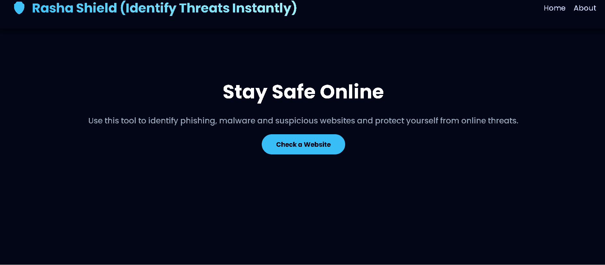
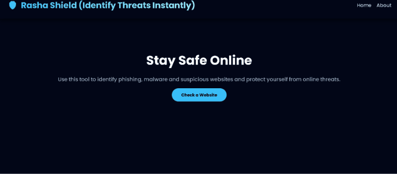

<p align="center">
  
</p>

<h1 align="center">Rasha Shield</h1>

<p align="center">
  Phishing Detection Tool
</p>

<p align="center">
  <a href="#overview">Overview</a> •
  <a href="#demo">Demo</a> •
  <a href="#tech-stack">Tech Stack</a> •
  <a href="#getting-started">Getting Started</a> •
  <a href="#usage">Usage</a>
</p>

---

## 📖 Overview

Navigating the web safely is becoming increasingly complex. Modern scammers have transitioned from simple tricks to advanced technical deception, crafting URLs that are visually indistinguishable from legitimate services to deceive even the most cautious users.

**Rasha Shield** uses a combination of intelligent pattern analysis and official security databases to evaluate every link before it reaches the user.

---

### 🔍 Detection Layers

Our system analyzes every URL through **six primary security vectors**:

**1️⃣ Typosquatting Detection**  
We detect look-alike attacks where attackers use homoglyphs or subtle misspellings  
(e.g., `netfl1x.com`, `amaz0n.com`) to exploit human visual perception.

**2️⃣ Dash-Stuffing Analysis**  
Legitimate enterprise domains rarely use excessive hyphens. Rasha Shield flags domains that overload dashes to mimic real file paths or sentences.

**3️⃣ Subdomain Length Monitoring**  
Scammers frequently use elongated subdomains such as  
`paypal-secure-login.domain.com`  
to push the actual malicious domain off-screen on mobile devices.

**4️⃣ URL Obfuscation Checks**  
Identifies excessive percent-encoding, suspicious characters, and non-standard network ports commonly used to bypass traditional filters.

**5️⃣ High-Risk TLD Filtering**  
Rasha Shield flags TLDs statistically linked with higher malware activity, including:
- `.xyz`
- `.top`
- `.zip`

**6️⃣ Google Safe Browsing Integration**  
Beyond structural heuristics, Rasha Shield integrates with the **Google Safe Browsing API**, validating URLs against a real-time global threat database.

---

## 🎬 Demo

### 🔹 URL Scan – Non Standard Port
<p align="center">
  
</p>

---

### 🔹 URL Scan – Legitimate Website
<p align="center">
  
</p>

---

### 🔹 Dash-Stuffing Analysis
<p align="center">
  
</p>

---

## 🛠 Tech Stack

<p align="center">
  
  
  
  
  
</p>

---

## 🚀 Getting Started

### 📌 Prerequisites

To run this project locally, you only need a modern web browser.  
If you plan to modify or contribute, a code editor such as **VS Code** is recommended.

---

### ⚙️ Installation

1. **Clone the repository**
```bash
git clone https://github.com/Ansha-RA/Rasha-shield.git
```

2. **Navigate to the project directory:**

```
cd Rasha-shield
```

3. **Open the application:**
Simply open `index.html` in your preferred browser, or use the **Live Server** extension in VS Code for a real-time preview.

📖 Usage

1. **Enter a URL:** Type or paste the link you wish to verify into the search bar.
2. **Review Results:** The application will instantly display whether the website is a scam or not based on structural analysis (typos, TLD reputation, obfuscation) and the **Google Safe Browsing API** status.